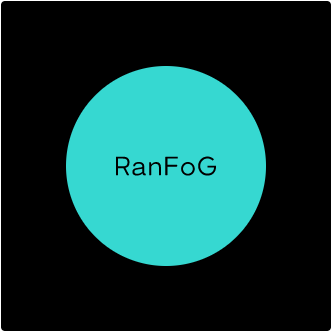
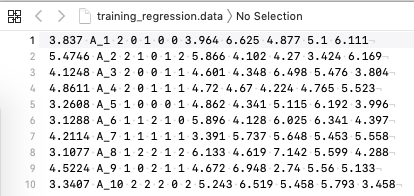
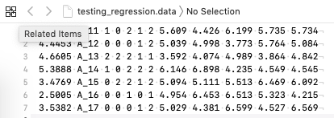
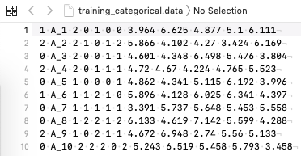
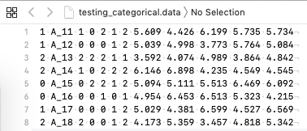

<p align="center">
  
</p>

   **RanFoG** is  java program to implement Random Forest in a general framework

# Introduction
This manual describes how to use the program RanFoG, which is focused, but not restricted to, on the analysis of genomic data using random forest. RanFoG can perform classification and regression problems. 

The code is written in Java SE 7 [1], which is an object oriented multiplatform operative system, with GNU GPL license and an extense class library. The program is compiled to run in all kind of platforms (windows, linux, mac, ..) that have previously installed the java virtual machine. Please, make sure your computer can run java code, otherwise the latest java virtual machine needs to be installedd. This is available at http://www.java.com/download/. 

Java was chosen due to its flexibility at creating and managing list and its multiplatform
characteristics.

# Purpose
This manual does not aim to thoroughly describe Random Forest theory or methodological details behind RanFoG code,but to be a self-explanatory guide to implement RanFoG in user's own data. Random Forest theory and methods implemented in Ran-FoG can be found in [2] and [3]. The user is encouraged to consult them for details. This is a developing software, therefore any feedback on possible bugs, problems,
running errors or suggestions are welcome and encouraged.

# 1 - How to execute RanFoG

Download the RanFoG [executable](RanFoG.jar).
or clone the repository:
```
mkdir GWP
git clone https://github.com/ogrecio/RanFog.git
cd RanFog
```

RanFoG must be run in a command line mode. The execution is simple, just type in the command line the following order depending on your problem category:

```
java -jar RanFoG.jar 
```

RanFoG needs a parameter file named 'params.txt' 

>Caution:  
>  store different runs in different folders, or RanFoG will overwrite previous results.

At each iteration the program prompts the iteration number, the mean squared error in the testing set, the vaue of the Loss Function in the out of bag samples (which provides an estimate for the generalization error), and the number of records in the out of bag samples.


# 2 - Input Files

## Data files
The program needs two input files: a training set and a testing set. Inferences will be done using the training set, whereas the testing set will be used to test the predictive ability of Random Forest under the given scenario. Both files must have the same format, with p+2 columns separated by spaces. First column is the numerical response variable (linear phenotype or disease status). Second column is the alphanumeric ID of the individual. Then, p columns with the value of each feature. 

```
outcome ID s1 s2 s3 s4 s5 s6 s7 s8 s9 s10 s11 s12 s13 s14 s15 s16 s17 s18 s19 s20
```

In case that predictions are not neccesary, the user must still provide a testing set. Just copy a few lines of the training file to create a testing file, and use it as if it were a real testing file. Then, discard the 'Trees.test' and 'Predictions.txt' files.

### Example of regression problems:

* *Training Data file* *




* *Testing Data file* *




### Example of classification problems:

Disease statuts must be coded as 0=non-affected or 1=affected. Predictions from RanFoG will indicate the genetic probability of the animal to suffer the disease.


* *Training Data file* *




* *Testing Data file* *




## params.txt file 
The parameter file needs the following options:


training= *training_file*     ```A string with the name or path to the training file``` 

testing= *testing file*       ```A string with the name or path to the testing file``` 

ForestSize= *integer*          ```Number of trees to be grown```

mtry= *integer*                  ```Number of random features to be checked to split the node```

N_features= *integer*     ```Number of features in the files```

max_branch= *integer*     ```Number of expected branches per tree.```

> *max_branch* is a internal parameter. More complez trees need of large max_branch value (>5000). A larger value of max_branch is needed if this error is prompted: 
>java.lang.ArrayIndexOutOfBoundsException: 100
>	at RanFog.main(RanFog.java:322)
          
LossFunction= *integer*     ```Loss function used to split the nodes.```

>Loss_function_option:
>    1.-Information Gain:
>    2.-L2: This is the standard mean squared error loss. This opction can be used with continuous and discrete covariates and response variable.
>    3.-pseudo-Huber
>    4.-Personalized Cost function
>    5.-Gini Index

>The L2 and pseudo-Huber loss functions can be used with categorical and continuous features and response variables.
>The Information Gain can only be used with dicotomous response variable (0 or 1), and a maximum of three classes in the features (0, 1 or 2).
>The Gini Index can be used with categorical response variable up to three classes codified as 0, 1 or 2. It allows continuous or classified (up to a maximum of three classes coddified as 0, 1 or 2) features.

A personalized Cost Function can be implemented on dicotomous response variables. It accepts any sort of features. Aditional parameters must be included in the params.txt file:

>	false_positive_cost= *cost1* ```Cost of a false positive (individual incorrectly assigned y_hat=1)```
>	false_negative_cost= *cost2* ```Cost of a false negative (individual incorrectly assigned y_hat=0)```

This is useful for problems in which more emphasis needs to be placed on assigning correct values to a given category.


Below is an example of the *params.txt* file.


**Note:** the param.txt file must be in the same directory as RanFoG.jar The 'java -jar RanFog.jar' command will implement the neccesary classes and methods of the java virtual machine in your computer to run the compressed java code.


# 3 - Output files

RanFoG creates six output files which are organized in columns separated by spaces. Four of them are referred to inferences made on the training file: 'Variable_Importance.txt', 'TimesSelected.txt', 'Trees.txt' and 'EGBV.txt'.

- *TimesSelected.txt* -- This file is organized in columns ordered by feature in the input file. First column is the order of the feature in the input file, and second column is the number of times a feature is selected to split a node. This file may provide an insight of the importance of the covariates, however, to know their real importance, the user must use the 'Variable_Importance.txt ' file.

- *Variable_Importance.txt* -- This file is organized in columns ordered by feature in the input file. First column is the order of the feature in the input file, and second column is the variable importance. Third column is the relative importance of the feature with respect to the most important one. The higher the value in the third column, the more important the variable is. To obtain the relative variable importance, these values have been divided by the maximum variable importance among all covariates. To know details on the calculation of variable importance, please refer to [3]. When using the Gini coefficient, or the informatio gain, the most important features may be negative.

- *Trees.txt* -- This file is also organized in columns ordered by tree constructed. The first column is the acumulatted Loss Function in the training file, whereas the second column is the Loss Function in the respective out-of-bag sample. Please, refer to [3] for details on how these sample sets are constructed.

- *EGBV.txt* -- This file contains two columns. The first one is the corresponding ID of individuals in the training set. The second column is the estimated value in regression problems or the predicted probability of that individual of being susceptible to the analyzed event in
classification problems. 

The files *Predictions.txt* and *Trees.test* are generated from predictions in the testing file.

- *Trees.test* -- This is a single column file containing the accumulated Loss Function in the testing set by number of tree. Therefore, first row is the missclassification rate after the first tree is constructed, and the last row is the missclassification rate after the whole forest was grown. Please, refer to [3] for details on how predictions are calculated.

- *Predictions.txt* -- This file contains two columns. The first one is the corresponding ID of individuals in the testing set. The second column is the predicted value in regression problems or the predicted probability of that individual of being susceptible to the analyzed event in classification events.

# Brief summary of result

An Rmarkdown file is provided [here](RanFog_OutputSummary.Rmd) to help with a first preliminary analysis of the results in R.

# Bibliography

[1] Horstmann C. Java Concepts. John Wiley and Sons, Inc, 2008.

[2] Breiman L. Random forest. Machine Learning, 45(1):5-32, 2001.

[3] Gonzalez-Recio O. and S. Forni. 2011. Genome-wide prediction of discrete traits using bayesian regressions and machine learning. Genetics Selection Evolution volume 43: 7.

[4] Breiman L. Bagging predictors. Machine Learning, 24:123-140, 1996.

[5] Tibshirani R., 1996. Bias, variance, and prediction error for classification rules. Technical Report, Statistics Department, University of Toronto.


# FAQ


-*How can Ranfog distinguish between categorical and continuous features?*

Ranfog treat all covariates as continuos. It subsequently split the node based on the mean value of the selected covariate. If the user is interested on treating a feature as a categorical, this feature must be codified as a dummy variable instead. For instance, for a feature with 3 levels (A, B, C), substitute it for 3 dummy variables with possible values either 0 or 1. Each new variable represents a level of the feature. This is:

A record with a value "level A" in the factor is codified as 1 0 0.

A record with a value "level B" in the factor is codified as 0 1 0.

A record with a value "level C" in the factor is codified as 0 0 1.

-*How can I optimized the number of trees?*

The number of trees to convergence can be monitorized in the Trees.txt file. The algorithm is supposed to converge once the loss function reaches a plateau. If a testing set is used, the user can monitorize the accumulated loss function in the testing set from the Trees.test file.  
